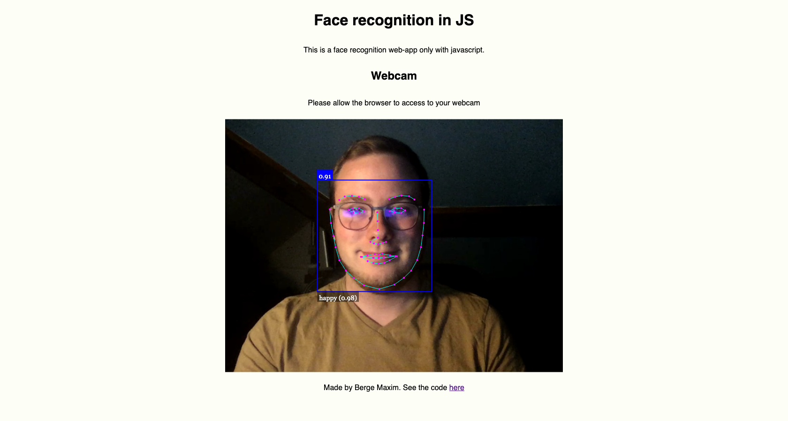

# Face-recognition-JS

## What is it?

A simple javascript project that recognize faces and emotion on those faces from a webcam video feed.

## Screenshot

## Library
[Face API](https://github.com/justadudewhohacks/face-api.js)

## Note

**Work with Google Chrome**. Can have some webcam issues with firefox.